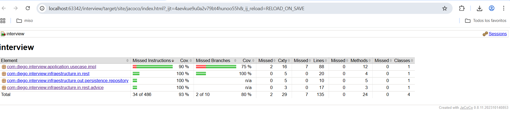
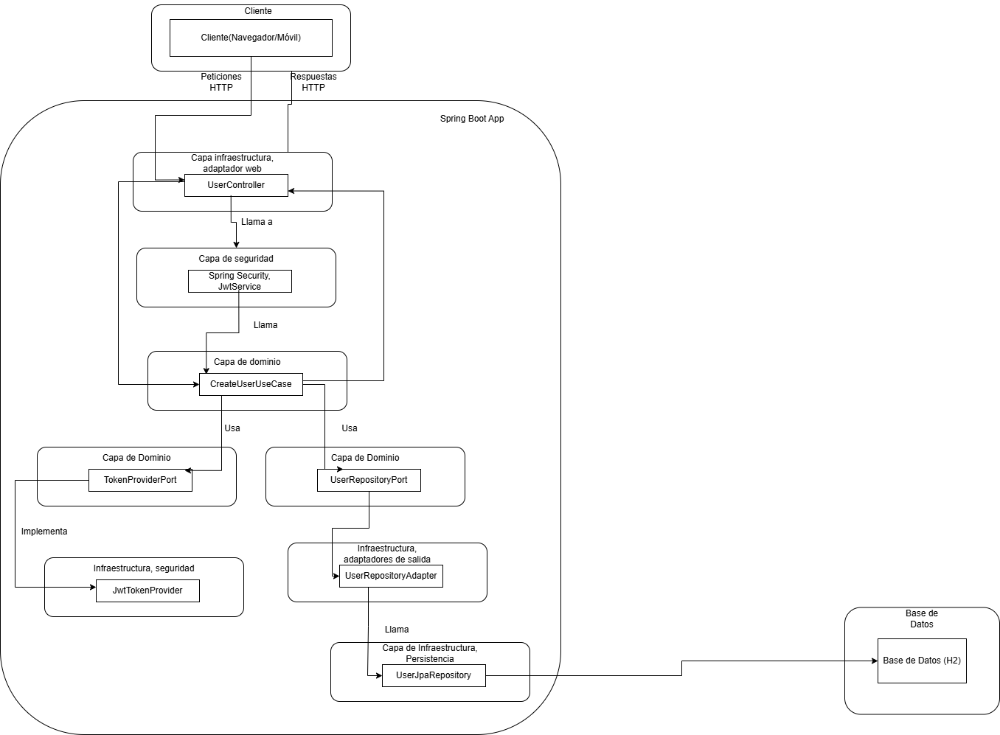

# User API – Evaluación Java

API RESTful para gestión de usuarios que cumple con los requisitos de la evaluación:

- Creación de usuarios (con arquitectura preparada para CRUD completo).
- Respuestas y errores en formato JSON.
- Validaciones de negocio (correo único, formato de correo, contraseña segura).
- Autenticación JWT.
- Base de datos en memoria H2 con migraciones mediante Liquibase.
- Arquitectura Hexagonal (Domain / Application / Infrastructure).
- Documentación con Swagger / OpenAPI.
- Internacionalización (i18n) de mensajes de error (ES/EN).
- Pruebas unitarias.

---

## 🚀 Tecnologías

- Java 17
- Spring Boot
- Spring Web
- Spring Security
- Spring Data JPA
- H2 Database
- Liquibase
- JJWT (io.jsonwebtoken)
- SpringDoc OpenAPI (Swagger UI)
- JUnit 5, Mockito, AssertJ

---

## 🧱 Arquitectura (Hexagonal + Application Layer)

La solución sigue una arquitectura hexagonal con una capa de **aplicación** intermedia:

```
src/main/java/com.diego.interview
│
├── application/
│   └── usecase/
│       ├── dto/                         
│       ├── impl/                        
│       │     └── CreateUserUseCaseImpl
│       └── CreateUserUseCase            
│
├── domain/
│   ├── model/                           
│   ├── port/                            
│   └── exception/                       
│
├── infrastructure/
│   ├── config/                          
│   ├── in/
│   │   └── rest/                        
│   │       └── advice/                  
│   ├── out/
│   │   └── persistence/                 
│   │       └── mapper/                  
│   └── security/                        
│
└── InterviewApplication.java            
```

### Capas detalladas

#### **Application Layer**
- Orquesta los casos de uso sin depender de framework.
- Implementa reglas específicas del caso de uso.
- Conecta domain ↔ infrastructure mediante puertos.

#### **Domain Layer**
- Modelos (`User`, `Phone`)
- Puertos (`UserRepository`, `TokenProvider`)
- `BusinessException` (usa códigos i18n)

#### **Infrastructure Layer**
- Adapters REST (entrada)
- Adapters JPA (salida)
- Seguridad JWT
- Configuración i18n

---

## ⚙️ Configuración de JWT

```properties
security.jwt.secret=0123456789_0123456789_0123456789_01
security.jwt.expiration-in-seconds=3600
```

---

## 📘 Cómo probar la API

### 1. Ejecutar

```
mvn clean install
mvn spring-boot:run
```

### 2. Swagger

```
http://localhost:8080/swagger-ui/index.html
```

### 3. Ejemplo de creación de usuario

```json
{
  "name": "Diego",
  "email": "diego@example.com",
  "password": "Abcdef12@",
  "phones": [
    {
      "numero": "3124567890",
      "codigoCiudad": "1",
      "codigoPais": "57"
    }
  ]
}
```

---

## 🔎 Pruebas unitarias incluidas

- `CreateUserUseCaseImplTest`
- `JwtTokenProviderTest`
- `UserRepositoryAdapterTest`
- `UserControllerTest`

---
## 🔍 Cobertura de Código con JaCoCo

El proyecto incluye integración con **JaCoCo** para medir cobertura de pruebas automatizadas.

### ▶️ Cómo generar el reporte

Ejecuta:

```bash
mvn clean verify
```

Esto:

- Ejecuta los tests
- Genera el reporte de cobertura
- Aplica reglas de validación (si están configuradas)

El reporte estará disponible en:

```
target/site/jacoco/index.html
```

### 📏 Validación de cobertura mínima

El plugin de JaCoCo puede fallar el build si la cobertura
mínima no se cumple. Ejemplo (80% mínimo):

```xml
<limit>
    <counter>LINE</counter>
    <value>COVEREDRATIO</value>
    <minimum>0.80</minimum>
</limit>
```

### 📁 Configuración del plugin

El plugin se encuentra en el `pom.xml`:

```xml
<plugin>
    <groupId>org.jacoco</groupId>
    <artifactId>jacoco-maven-plugin</artifactId>
    <version>0.8.11</version>
    <executions>
        <execution>
            <id>prepare-agent</id>
            <goals>
                <goal>prepare-agent</goal>
            </goals>
        </execution>
        <execution>
            <id>report</id>
            <phase>verify</phase>
            <goals>
                <goal>report</goal>
            </goals>
        </execution>
        <execution>
            <id>check</id>
            <phase>verify</phase>
            <goals>
                <goal>check</goal>
            </goals>
            <configuration>
                <rules>
                    <rule>
                        <element>BUNDLE</element>
                        <limits>
                            <limit>
                                <counter>LINE</counter>
                                <value>COVEREDRATIO</value>
                                <minimum>0.80</minimum>
                            </limit>
                        </limits>
                    </rule>
                </rules>
            </configuration>
        </execution>
    </executions>
</plugin>
```
## 📄 Diagrama de Arquitectura General


---
## 📄 Diagrama de Arquitectura Del Microservicio


## Notas adicionales

- **Configuración de expresiones regulares**:  Edita src/main/resources/application.yml para modificar las reglas de validación de correo y contraseña.
- **Persistencia**: Los datos se almacenan en memoria y se pierden al reiniciar la aplicación.
- **Swagger**: Permite probar los endpoints y ver los modelos de datos.
- **Manejo de errores**: Todos los errores retornan JSON con el campo mensaje.